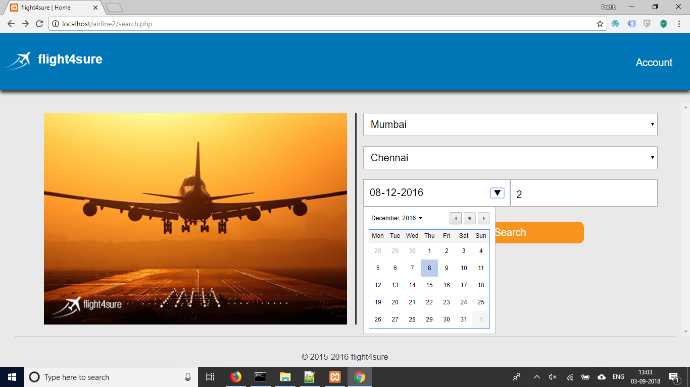
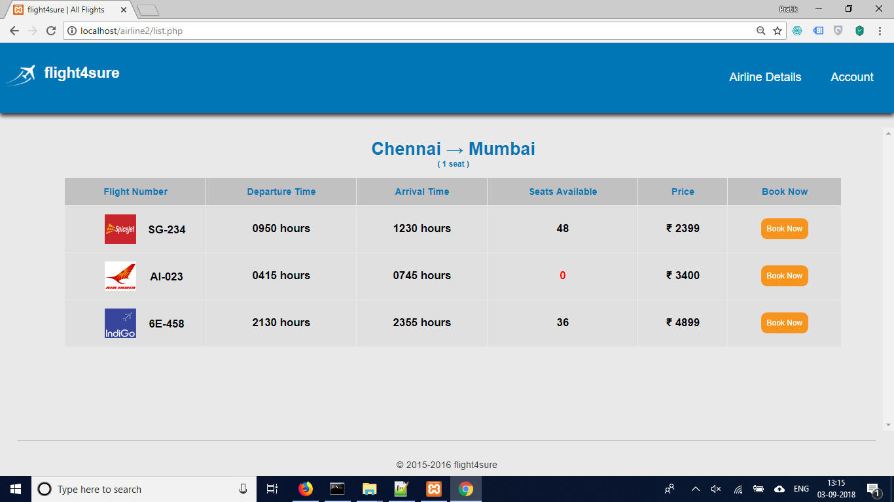
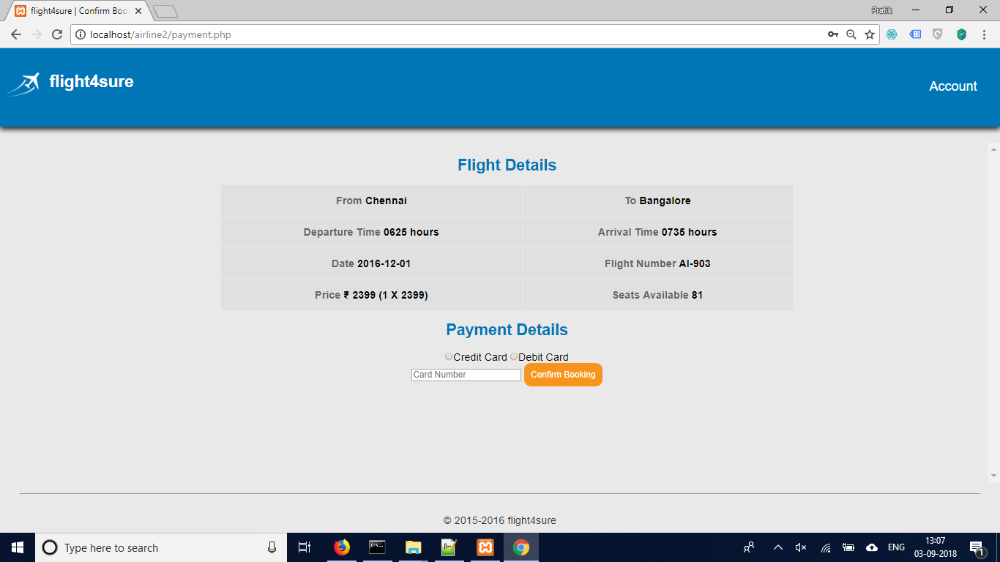
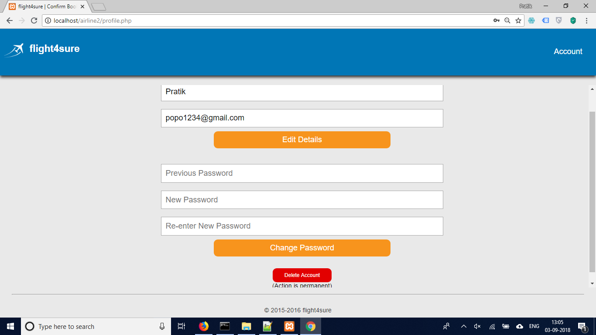
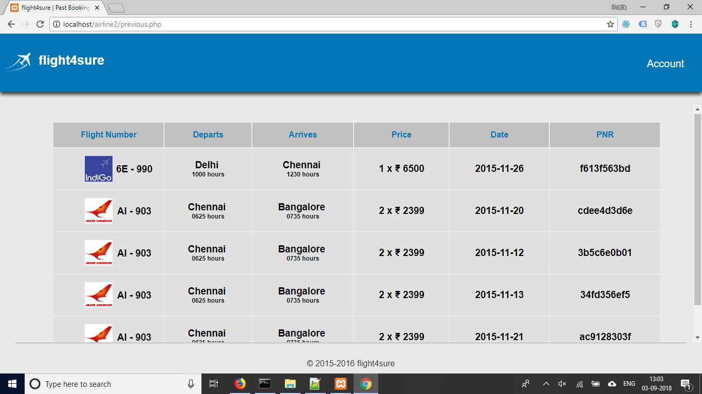
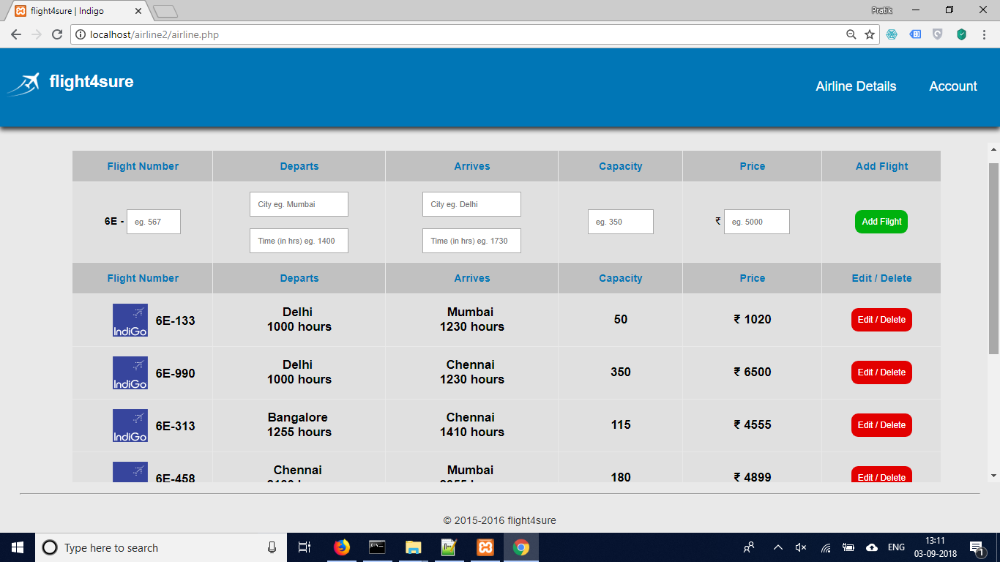

# Airline Reservation System

A online airline ticketing System to allow users to buy cheap domestic tickets

## Key Features
- Users can search for flights based on Source, destnation and business day
- Usesr can view all avalabale flights for a given day and choose to book the one best suited for them
- Ability to view all previous bookings
- Admin Panel, to allow airline repreentatives to add new flights or modify existing ones

## Screenshots of Site

HomePage: Simple UI for user to enter details to search for flights

Result Page: Flight Information for all flights matching users query

Payment Page: User can confirm cost and make payment

Confirmation Page: Displays PNR number to user after successful payment

User Profile: User can edit details or delete account

Previous bookings: User can view past booking from the website

Admin: Admin Control Panel, from which airline representatives can add new flights, or modify exisiting ones

